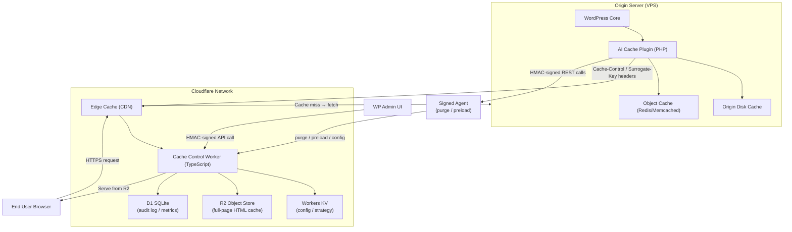

# Architecture

This document describes the overall architecture of the **AI WP Dynamic Cache Plugin** — a WordPress plugin paired with a Cloudflare Workers control plane that dynamically selects the fastest, safest caching strategy for a given origin server using on-demand sandbox benchmarks.

---

## Table of Contents

1. [System Overview](#system-overview)
2. [Component Descriptions](#component-descriptions)
3. [Data Flows](#data-flows)
4. [Technology Stack](#technology-stack)
5. [Design Decisions](#design-decisions)

---

## System Overview



---

## Component Descriptions

### WordPress Plugin (PHP)

**Location:** `includes/`, `admin/`

The plugin is the on-origin half of the system. Its responsibilities are:

| Responsibility | Implementation |
|---|---|
| Emit correct `Cache-Control` and `Surrogate-Key` headers | `CacheHeaderEmitter` class hooks `send_headers` |
| Detect bypass conditions (logged-in, cart, admin bar) | `BypassDetector` class |
| Trigger purge on post save/transition | `PurgeDispatcher` hooks `save_post`, `transition_post_status` |
| Serve from disk cache when Cloudflare is unavailable | `DiskCacheDriver` |
| Manage plugin settings | `SettingsManager` + WP Options API |
| Run and interpret sandbox benchmarks | `BenchmarkOrchestrator` |
| Select active caching strategy | `StrategySelector` |

The plugin exposes a WP-REST namespace `ai-cache/v1` for internal communication with the Signed Agent.

### Signed Agent

**Location:** `includes/Agent/`

A thin PHP process (executed via WP-CLI or REST) that signs outbound API requests to the Cloudflare Worker using HMAC-SHA256 with a rotating secret stored in `wp_options`. The Agent:

- Adds `X-Timestamp`, `X-Nonce`, and `X-Signature` headers to every request.
- Handles retry logic and exponential back-off.
- Converts plugin events (purge, preload, strategy update) into Worker API calls.

See [`docs/threat-model.md`](threat-model.md) for signing details.

### Edge Worker (TypeScript)

**Location:** `worker/src/`

The Cloudflare Worker sits at the edge and intercepts every HTTP request to the origin. It:

1. **Constructs a cache key** from the normalized URL + variant dimensions (see [`docs/cache-keying.md`](cache-keying.md)).
2. **Checks Cloudflare Edge Cache** first (built-in CDN `cache.match()`).
3. **Falls through to R2** if edge cache misses.
4. **Falls through to origin** if R2 misses, then populates both R2 and edge cache on the way back.
5. **Handles purge requests** from the Signed Agent (validates HMAC, then issues `cache.delete()` and R2 object delete).
6. **Handles preload requests** (fetches origin proactively and stores in R2 + edge).
7. **Reads active strategy from KV** — no cold-start penalty; KV is at edge.
8. **Writes audit events to D1** for metrics and replay detection.

### Cloudflare Edge Cache

The native Cloudflare CDN layer. Controlled entirely via `Cache-Control`, `CDN-Cache-Control`, and `Surrogate-Control` response headers set by the plugin. TTLs and bypass rules are defined in [`docs/cache-contract.md`](cache-contract.md).

### R2 Object Store

Used as a long-lived, globally replicated HTML cache that survives Cloudflare Edge cache evictions. Objects are keyed by the SHA-256 hash of the normalized cache key (see [`docs/cache-keying.md`](cache-keying.md)). R2 is written by the Worker on cache-fill and deleted on purge.

### Workers KV

Stores per-site configuration and the currently active caching strategy selected by the benchmark system. KV is read on every Worker request with negligible latency. Keys:

- `strategy:{zone_id}` — active strategy name (`disk-only`, `disk+edge`, `disk+r2`, `full-stack`)
- `config:{zone_id}` — JSON blob with TTL tiers, bypass rules, preload settings

### D1 (SQLite at Edge)

Append-only audit log and metrics store. Tables:

- `purge_log` — records every purge event (tag, timestamp, actor, nonce)
- `preload_log` — records preload attempts and results
- `benchmark_results` — historical strategy scores per zone

### Origin Disk Cache

A PHP-level full-page HTML cache written to the server filesystem. Acts as a last-resort layer when Cloudflare is unreachable or misconfigured. Managed by `DiskCacheDriver`.

### Object Cache (Redis / Memcached)

Standard WordPress object cache, used to cache DB query results, transients, and fragment caches. Connected via the standard `WP_Object_Cache` drop-in. The benchmark system measures its latency relative to disk and edge to inform strategy selection.

### Admin UI

**Location:** `admin/`

A WordPress admin page (Settings → AI Cache) providing:

- Live cache hit rate visualization (polling Worker D1 metrics API)
- Strategy selector (auto / manual override)
- Manual purge controls (by URL, tag, or global)
- Benchmark trigger and results display
- Connection status for Cloudflare Worker, R2, KV, D1

---

## Data Flows

### Cache Hit (Edge)

```
Browser → Cloudflare Edge → [HIT] → Return cached response
```

1. Browser sends `GET /page`.
2. Cloudflare Edge matches cache key.
3. Cached response returned; Worker is **not** invoked.

### Cache Hit (R2 Fallback)

```
Browser → Cloudflare Edge → [MISS] → Worker → R2 [HIT] → Return + repopulate Edge
```

1. Edge cache miss routes to Worker.
2. Worker constructs cache key, queries R2.
3. R2 returns HTML; Worker streams it to browser and calls `waitUntil()` to write it back to edge cache.

### Cache Miss (Origin Fill)

```
Browser → Edge → Worker → R2 [MISS] → Origin → Worker → R2 write + Edge write → Browser
```

1. Both edge and R2 miss.
2. Worker fetches origin with `fetch(request, { cf: { cacheEverything: false } })`.
3. Origin plugin emits `Cache-Control` and `Surrogate-Key` headers.
4. Worker stores response in R2 and populates edge cache.
5. Response returned to browser.

### Purge Flow

```
WP event (save_post) → PurgeDispatcher → SignedAgent → Worker /purge → Edge cache.delete + R2 delete
```

1. WordPress `save_post` fires.
2. `PurgeDispatcher` collects affected `Surrogate-Key` tags.
3. `SignedAgent` sends HMAC-signed `POST /purge` to Worker with tag list.
4. Worker validates signature + nonce, logs to D1, calls `cache.delete()` for each key, and deletes R2 objects.

### Preload Flow

```
After purge → Worker enqueues preload jobs → Worker fetches origin proactively → stores in R2 + Edge
```

See [`docs/preload-system.md`](preload-system.md) for full detail.

---

## Technology Stack

| Layer | Technology | Rationale |
|---|---|---|
| WordPress Plugin | PHP 8.1+, PSR-12 | Native WP platform; strict types for safety |
| Edge Worker | TypeScript, Cloudflare Workers runtime | Zero cold-start, global distribution, native KV/R2/D1 bindings |
| Edge Cache | Cloudflare CDN | Transparent, no extra cost, header-driven |
| Long-lived Cache | Cloudflare R2 | S3-compatible, free egress, global replication |
| Config Store | Workers KV | Ultra-low read latency at edge |
| Audit / Metrics | Cloudflare D1 | SQL queries without an external database |
| Object Cache | Redis 7 / Memcached | Standard WP drop-in ecosystem |
| Disk Cache | PHP filesystem | No external dependency; benchmark baseline |
| Benchmarking | Docker Compose + k6 + Lighthouse | Reproducible, VPS-local, no external service needed |
| CI | GitHub Actions | Already hosting the repo; native secret management |

---

## Design Decisions

### Why on-demand sandbox benchmarks?

Every VPS has different CPU, disk I/O, and network characteristics. A fixed strategy (e.g., "always use Redis") is suboptimal on a slow-disk/fast-CPU host versus a fast-NVMe/slow-network host. The benchmark system measures actual latency on the target hardware and selects the strategy with the best P95 TTFB, making the plugin self-optimizing.

### Why R2 in addition to edge cache?

Cloudflare Edge cache has limited storage per zone and evicts under memory pressure. R2 acts as a durable, unlimited backing store so that popular but infrequently requested pages remain cached across evictions without hitting the origin.

### Why D1 for audit logs instead of KV?

KV is a simple key-value store optimized for reads. Audit logs require append-only writes with structured queries for replay-attack detection (nonce lookups) and metrics aggregation. D1's SQL interface makes these queries trivial.

### Why HMAC-SHA256 for signing?

Ed25519 would be stronger for asymmetric scenarios but adds key management complexity. Since both signer (origin plugin) and verifier (Worker) are controlled by the same operator and secrets are stored in WP options + Cloudflare Worker secrets, HMAC-SHA256 provides sufficient security with simpler implementation and no dependency on a crypto library in the Worker runtime.
