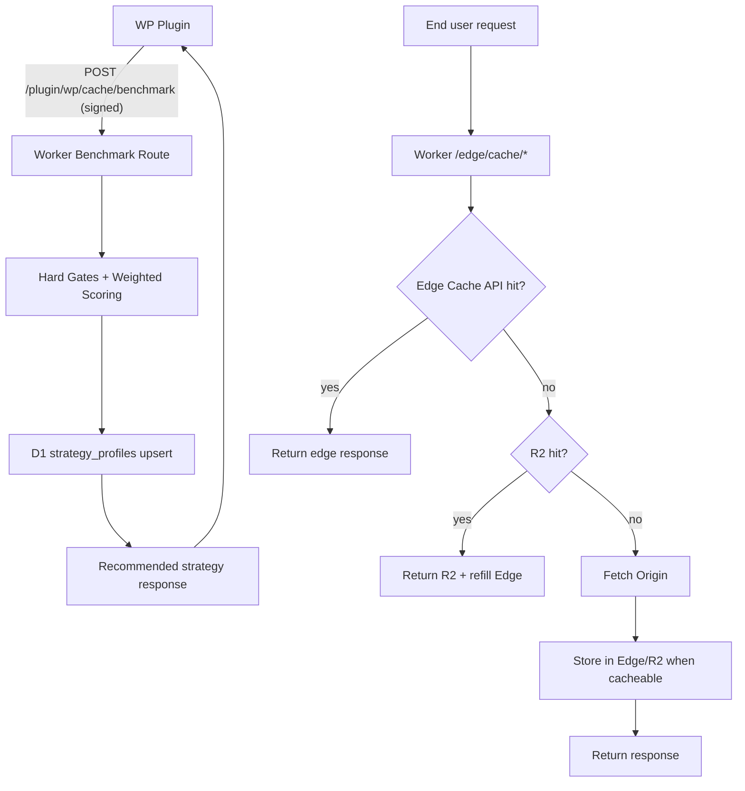

# Architecture

## Goals

- Keep request serving deterministic and independent from AI availability.
- Use sandbox benchmarks to pick the best cache strategy per VPS.
- Persist strategy profiles in D1 so Workers enforce a known-good profile.

## High-level components

- WordPress plugin (`ai-wp-dynamic-cache.php` + `wordpress-plugin/src/Plugin.php`)
  - Sends signed benchmark payloads and sandbox operations.
  - Applies safe cache headers on frontend responses.
- Cloudflare Worker (`workers/src/index.ts`)
  - Verifies signed plugin requests.
  - Evaluates benchmark candidates with hard gates + weighted scoring.
  - Persists profile in D1 (`strategy_profiles`).
  - Exposes sandbox queue + conflict endpoints for multi-agent coordination.
  - Executes edge cache chain: Edge Cache API -> R2 -> Origin.
- D1
  - Stores per-site, per-VPS strategy profile with component scores.
  - Stores shared per-page load-test samples from all workers.
- R2
  - Secondary cache layer for larger or reusable objects.

## Request flow

## Benchmark scoring model

Hard gates (any failure rejects the candidate):

- digest mismatch (wrong content)
- personalized content leak for authenticated users
- purge outside max invalidation window
- cache key collision

Weighted score:

- 60% latency score (p95 emphasized)
- 20% origin load score
- 10% cache hit quality
- 10% purge MTTR score

Result:

- Highest score among gate-passing candidates is selected.
- Selected profile is persisted by `site_id + vps_fingerprint`.
- Shared strategy bonus (from historical per-page p95 across workers) is added to passing candidates to improve convergence on real-world winners.

## AI role boundaries

AI can assist with:

- route/template risk classification
- preload prioritization under budget
- benchmark result summarization
- safe tuning suggestions

AI is not in runtime serving path. Request serving and cache decisions use deterministic rules and persisted profiles.
