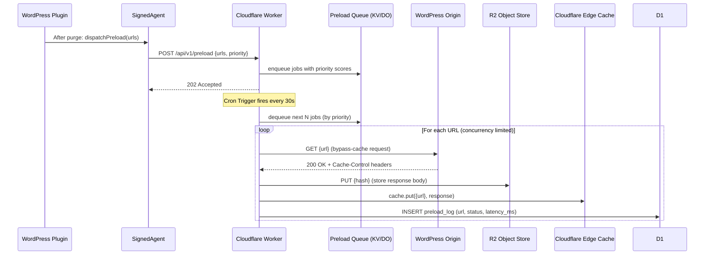

# Preload System

This document describes the **preload system** — how the plugin proactively warms the Cloudflare Edge and R2 cache after purge events, scheduled intervals, or sitemap-driven crawls.

---

## Table of Contents

1. [Overview](#overview)
2. [Preload Trigger Conditions](#preload-trigger-conditions)
3. [Priority Queue Design](#priority-queue-design)
4. [Rate Limiting and Concurrency](#rate-limiting-and-concurrency)
5. [Preload API Endpoint Specification](#preload-api-endpoint-specification)
6. [Preload Execution Flow](#preload-execution-flow)
7. [Failure Handling and Retry Logic](#failure-handling-and-retry-logic)
8. [Configuration Reference](#configuration-reference)

---

## Overview

After a purge, affected cache entries are cold. Without preloading, the next real visitor for each page pays the origin response time. The preload system eliminates this "thundering herd" problem by having the **Cloudflare Worker** proactively fetch and cache those pages before real traffic arrives.

The system is intentionally **asynchronous**: purge acknowledgement is returned to WordPress immediately, and preload jobs run in the background. This keeps the WordPress request cycle fast.

---

## Preload Trigger Conditions

| Trigger | Description | Default State |
|---|---|---|
| **Post-purge** | When a purge request is accepted by the Worker, affected URLs are automatically enqueued for preload | ✅ Enabled |
| **Scheduled** | A WP-Cron or Cloudflare Cron Trigger runs every N minutes and preloads the top-priority URLs | ✅ Enabled (every 30 min) |
| **Sitemap crawl** | On activation or manual trigger, the plugin parses the site's XML sitemap and bulk-enqueues all discovered URLs | ❌ Disabled by default |
| **Manual** | Admin UI allows manually enqueuing a specific URL or set of URLs | ✅ Always available |
| **Deployment** | When a new Worker version is deployed, a full-site preload is optionally triggered | ❌ Optional |

### Post-Purge Trigger Detail

When the Worker processes a purge request:

1. For each purged cache key, the Worker resolves the canonical URL from the purge metadata stored in D1.
2. These URLs are appended to the preload queue (Workers KV, key: `preload-queue:{zone_id}`).
3. A Durable Object (or Cron Trigger, depending on config) drains the queue asynchronously.

---

## Priority Queue Design

The preload queue is a **sorted list** stored in Workers KV (small queues) or a Durable Object (large queues). Each queue entry has the following shape:

```json
{
  "url": "https://example.com/blog/my-post/",
  "priority": 85,
  "enqueued_at": 1700000000,
  "trigger": "post-purge",
  "post_id": 123,
  "attempt": 0
}
```

### Priority Scoring

Higher priority = preloaded sooner. Priority is computed as:

```
priority = base_priority + recency_bonus + traffic_bonus
```

| Component | Value | Source |
|---|---|---|
| `base_priority` by trigger | `post-purge` = 80, `scheduled` = 50, `sitemap` = 30, `manual` = 100 | Hardcoded |
| `recency_bonus` | `max(0, 20 - hours_since_published)` | Post publish date |
| `traffic_bonus` | `min(30, log10(monthly_pageviews) * 10)` | Stored in D1 from analytics |

The queue is dequeued in **descending priority order**, with ties broken by `enqueued_at` (FIFO).

### Queue Storage Backends

| Queue Size | Backend | Notes |
|---|---|---|
| ≤ 1,000 entries | Workers KV | Simple JSON array; sufficient for small sites |
| > 1,000 entries | Durable Object (`PreloadQueue`) | Ordered map with O(log n) insert/pop |

The backend is selected automatically based on the `preload_queue_backend` KV config value.

---

## Rate Limiting and Concurrency

Preloading must not overwhelm the origin server or exhaust Cloudflare fetch quotas.

### Concurrency Limits

| Limit | Default | Configurable |
|---|---|---|
| Max concurrent preload fetch subrequests | 6 | `preload_max_concurrency` |
| Max preload requests per second per zone | 10 | `preload_rps_limit` |
| Max preload requests per minute per zone | 120 | `preload_rpm_limit` |
| Max queue depth | 10,000 | `preload_queue_max_depth` |

When `max_concurrency` is reached, additional jobs wait until a slot frees (token bucket implementation).

### Cloudflare Subrequest Budget

Each Cloudflare Worker invocation has a subrequest budget (50 subrequests on the free plan, 1,000 on paid). The preload system respects this by:

1. Capping the number of preload fetches performed per Worker invocation.
2. Using `waitUntil()` for background fetch + cache population so that the main response is not delayed.
3. Scheduling remaining jobs in the next Cron Trigger tick when the budget is exceeded.

### Origin Protection (Circuit Breaker)

If the origin returns 5xx errors on ≥ 3 consecutive preload fetches for a zone, the preload system activates a **circuit breaker** for that zone:

- Preload pauses for an exponentially increasing back-off (initial: 30 s, max: 30 min).
- An alert is emitted to D1's `preload_alerts` table.
- The circuit closes again when the next scheduled check returns a 2xx response.

---

## Preload API Endpoint Specification

The WordPress Signed Agent sends preload requests to the Cloudflare Worker.

### Endpoint

```
POST https://worker.example.com/api/v1/preload
```

### Authentication

Same HMAC-SHA256 scheme as the purge endpoint (see [`docs/threat-model.md`](threat-model.md)):

```http
X-Timestamp: 1700000000
X-Nonce: <16-byte hex random>
X-Signature: <HMAC-SHA256(...)>
Content-Type: application/json
```

### Request Body

```json
{
  "zone_id": "abc123xyz",
  "idempotency_key": "preload-{uuid-v4}",
  "urls": [
    "https://example.com/blog/my-post/",
    "https://example.com/blog/another-post/"
  ],
  "priority": 80,
  "trigger": "post-purge"
}
```

| Field | Type | Required | Description |
|---|---|---|---|
| `zone_id` | string | ✅ | Cloudflare Zone ID |
| `idempotency_key` | string | ✅ | UUID v4 prefixed `preload-` |
| `urls` | string[] | ✅ | Canonical URLs to preload (max 100 per request) |
| `priority` | number | ❌ | Override default priority scoring (0–100) |
| `trigger` | string | ❌ | One of `post-purge`, `scheduled`, `sitemap`, `manual`, `deployment` |

### Response

**202 Accepted** — Jobs enqueued:

```json
{
  "preload_batch_id": "preload-{uuid-v4}",
  "status": "accepted",
  "enqueued": 2,
  "queue_depth": 14
}
```

**400 Bad Request** — Invalid payload or URL count exceeded.

**401 Unauthorized** — Invalid HMAC signature.

**429 Too Many Requests** — Rate limit exceeded.

---

## Preload Execution Flow



---

## Failure Handling and Retry Logic

### Retry Policy

| Failure type | Retry behaviour |
|---|---|
| Origin 5xx | Retry up to **3 times** with exponential back-off: 5 s, 25 s, 125 s |
| Origin 4xx (404, 410) | **No retry**; remove URL from queue and log to D1 as `gone` |
| Network timeout (> 30 s) | Retry up to **3 times** |
| R2 write failure | Retry up to **2 times**; if still failing, fall back to edge-cache-only (skip R2 write) |
| Queue full | **Drop** lowest-priority jobs to make room; log `queue_overflow` to D1 |

### Dead Letter Queue

After exhausting retries, failed jobs are moved to a **dead letter queue** (DLQ) stored in KV at `preload-dlq:{zone_id}`. The DLQ is:

- Visible in the Admin UI under "Preload → Failed Jobs".
- Automatically replayed once per hour (up to 10 DLQ jobs per tick).
- Cleared after 7 days.

### Alert Thresholds

| Condition | Alert |
|---|---|
| Preload failure rate > 10% over 5 min | D1 alert + Admin UI warning |
| Queue depth > 5,000 | D1 alert |
| Circuit breaker opens | D1 alert + Admin UI error banner |

---

## Configuration Reference

All settings are stored in Workers KV at `config:{zone_id}` and are editable via the Admin UI.

| Key | Default | Description |
|---|---|---|
| `preload_enabled` | `true` | Master on/off switch |
| `preload_post_purge` | `true` | Trigger preload after purge events |
| `preload_schedule_interval_s` | `1800` | Seconds between scheduled preload ticks |
| `preload_max_concurrency` | `6` | Max parallel preload fetches |
| `preload_rps_limit` | `10` | Max preload fetches per second |
| `preload_queue_max_depth` | `10000` | Maximum queue entries |
| `preload_queue_backend` | `kv` | `kv` or `durable-object` |
| `preload_retry_max` | `3` | Max retry attempts |
| `preload_circuit_breaker_threshold` | `3` | Consecutive failures to open circuit |
| `preload_circuit_breaker_max_backoff_s` | `1800` | Max back-off in seconds |
| `preload_sitemap_crawl_enabled` | `false` | Enable sitemap-driven preloading |
| `preload_sitemap_url` | `{site_url}/sitemap.xml` | Sitemap URL to crawl |
