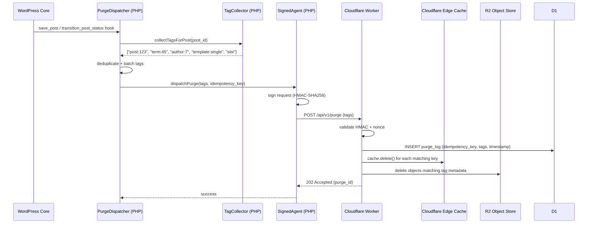

# Purge and Tag System

This document describes the **surrogate key** (cache tag) system and the purge API used by the AI WP Dynamic Cache Plugin to invalidate cached content precisely and efficiently.

---

## Table of Contents

1. [Overview](#overview)
2. [Surrogate-Key Header Format](#surrogate-key-header-format)
3. [Tag Taxonomy](#tag-taxonomy)
4. [Purge API Endpoint Specification](#purge-api-endpoint-specification)
5. [Purge on Content Change Flow](#purge-on-content-change-flow)
6. [Tag Cardinality and Batching](#tag-cardinality-and-batching)
7. [Purge Confirmation and Audit Log](#purge-confirmation-and-audit-log)

---

## Overview

**Surrogate keys** (also known as cache tags) allow the system to purge many related cached responses with a single API call, without enumerating individual URLs.

For example, when a post's parent category term is renamed, all pages that display posts from that term — archive pages, sidebars, related-posts widgets — must be purged. Tagging every such response with `term:{term_id}` makes the purge a single `POST /purge` call with `{ "tags": ["term:456"] }`.

---

## Surrogate-Key Header Format

The plugin emits two equivalent headers per cacheable response:

```http
Surrogate-Key: post:123 term:45 term:8 author:7 template:single site
Cache-Tag: post:123 term:45 term:8 author:7 template:single site
```

- Tags are **space-separated** strings in a single header value.
- `Surrogate-Key` is the historic Fastly/Varnish convention.
- `Cache-Tag` is Cloudflare's native header name (used internally by Cloudflare's Cache-Tag Purge API).
- Both headers are emitted for compatibility; the Worker uses `Cache-Tag` for Cloudflare edge purge and `Surrogate-Key` for R2 metadata.

### R2 Metadata

When the Worker stores a response in R2, it writes the tag list as custom HTTP metadata on the R2 object:

```
x-amz-meta-surrogate-keys: post:123 term:45 term:8 author:7 template:single site
```

This metadata is used during tag-based purge to enumerate and delete affected R2 objects without a full-bucket scan.

---

## Tag Taxonomy

Tags follow a `{dimension}:{id}` naming convention. IDs are always the WordPress integer ID of the corresponding object.

| Tag Pattern | Emitted On | Example |
|---|---|---|
| `post:{id}` | Single post/page/CPT, and any archive that includes the post | `post:123` |
| `term:{id}` | Term archive page, and any page listing posts from that term | `term:456` |
| `author:{id}` | Author archive page, and any page listing posts by that author | `author:789` |
| `template:{name}` | Any page rendered using that template | `template:single`, `template:archive`, `template:home` |
| `menu:{id}` | Any page that includes the navigation menu with that ID | `menu:3` |
| `widget:{id}` | Any page that renders the widget area containing that widget | `widget:sidebar-1` |
| `option:{key}` | Pages whose content depends on a specific WP option (e.g., site title) | `option:blogname` |
| `feed` | RSS/Atom feed URLs | `feed` |
| `sitemap` | All sitemap XML URLs | `sitemap` |
| `site` | Every cacheable response on the site (global tag) | `site` |

### Template Name Values

| `template:{name}` | Description |
|---|---|
| `template:home` | Front page and blog index |
| `template:single` | Single post |
| `template:page` | Static page |
| `template:archive` | Date, author, and generic archives |
| `template:category` | Category term archives |
| `template:tag` | Tag term archives |
| `template:tax` | Custom taxonomy archives |
| `template:search` | Search results pages |
| `template:404` | 404 not found pages |

### Tag Emission Rules

Tags are added by the `TagCollector` class which hooks `wp` (after WordPress has determined the current query). The collector examines `$wp_query` and applies the following rules:

1. **Always** emit `site`.
2. **Always** emit `template:{name}` for the current template.
3. If `is_singular()`: emit `post:{ID}`, `author:{post_author}`, and `term:{id}` for each assigned term.
4. If `is_archive()` for a term: emit `term:{term_id}` and each `post:{ID}` in the current page of results.
5. If `is_author()`: emit `author:{user_id}` and each `post:{ID}` in the current page.
6. If `is_home()` or `is_front_page()`: emit each `post:{ID}` in the loop.
7. If the page includes a menu: emit `menu:{menu_id}`.

---

## Purge API Endpoint Specification

Purge requests are sent by the WordPress Signed Agent to the Cloudflare Worker.

### Endpoint

```
POST https://worker.example.com/api/v1/purge
```

### Authentication

Every request must include HMAC-SHA256 authentication headers (see [`docs/threat-model.md`](threat-model.md)):

```http
X-Timestamp: 1700000000
X-Nonce: <16-byte hex random>
X-Signature: <HMAC-SHA256(secret, "POST\n/api/v1/purge\n{timestamp}\n{nonce}\n{sha256(body)}")>
Content-Type: application/json
```

### Request Body

```json
{
  "zone_id": "abc123xyz",
  "idempotency_key": "purge-{uuid-v4}",
  "tags": ["post:123", "term:45"],
  "urls": ["https://example.com/blog/hello-world/"],
  "global": false
}
```

| Field | Type | Required | Description |
|---|---|---|---|
| `zone_id` | string | ✅ | Cloudflare Zone ID |
| `idempotency_key` | string | ✅ | UUID v4 prefixed with `purge-`; prevents duplicate purges |
| `tags` | string[] | ✅ (one of) | List of surrogate key tags to purge |
| `urls` | string[] | ✅ (one of) | List of exact canonical URLs to purge |
| `global` | boolean | ❌ | If `true`, purges the entire zone (equivalent to `tags: ["site"]`) |

At least one of `tags`, `urls`, or `global: true` must be provided.

### Response

**202 Accepted** — Purge job enqueued:

```json
{
  "purge_id": "purge-{uuid-v4}",
  "status": "accepted",
  "tags_affected": ["post:123", "term:45"],
  "estimated_completion_ms": 500
}
```

**400 Bad Request** — Invalid payload.

**401 Unauthorized** — Invalid or expired HMAC signature.

**409 Conflict** — Duplicate `idempotency_key` within the replay window (5 minutes).

**429 Too Many Requests** — Rate limit exceeded (see [Tag Cardinality and Batching](#tag-cardinality-and-batching)).

---

## Purge on Content Change Flow



### Deferred Purge (Batch Window)

To avoid flooding the Worker with individual purge requests on bulk operations (e.g., importing 500 posts), `PurgeDispatcher` accumulates purge requests in a transient for up to **2 seconds** before dispatching. Requests are coalesced — duplicate tags are deduplicated, and the batch is sent as a single API call.

The batch window is configurable via `ai_cache_purge_batch_window_ms` (WordPress filter / plugin settings).

---

## Tag Cardinality and Batching

### Cardinality Limits

| Dimension | Limit | Rationale |
|---|---|---|
| Tags per response | 50 | `Cache-Tag` header size limit (~4 KB) |
| Tags per purge request | 30 | Cloudflare Cache-Tag Purge API limit per request |
| Purge requests per minute | 1,000 | Cloudflare API rate limit |
| Global purge per hour | 5 | Global purge is expensive; enforce deliberate use |

If a single purge event produces more than 30 tags, `PurgeDispatcher` automatically splits the tags into batches of 30 and dispatches them sequentially with a 100 ms delay between batches.

### R2 Tag Index

Because R2 does not natively support tag-based deletion, the Worker maintains a **tag index** in Workers KV:

```
kv-key:   tag-index:{zone_id}:{tag}
kv-value: ["hash1", "hash2", "hash3", ...]  (array of R2 object key hashes)
```

When an object is stored in R2, the Worker appends its hash to the KV index entry for each of its tags. When a tag is purged, the Worker reads the index, deletes each listed R2 object, and clears the index entry.

**Index size limit:** KV values have a 25 MiB limit. Each hash is 64 bytes + separator = ~65 bytes. This supports ~380,000 objects per tag index entry, which is sufficient for all realistic tag cardinalities. For sites that exceed this, the tag index is sharded (e.g., `tag-index:{zone}:{tag}:0`, `tag-index:{zone}:{tag}:1`).
